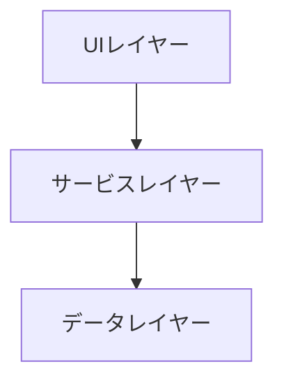

# 機能設計書作成スキル

このスキルは、高品質な機能設計書を作成するための詳細ガイドです。

## テンプレートの参照

機能設計書を作成する際は、次のテンプレートを使用してください: ./template.md

## 機能設計書の構成要素

### 1. システム構成図

**必ずMermaid記法で図示**

### 2. データモデル定義

エンティティごとに:
- 属性
- 型
- 制約
- 関連

### 3. コンポーネント設計

各コンポーネントの:
- 責務
- インターフェース
- 依存関係

### 4. ユースケース図

主要なユーザーフローを図示

## 詳細ガイド

さらに詳しい作成ガイドは次のファイルを参照してください: ./guide.md
