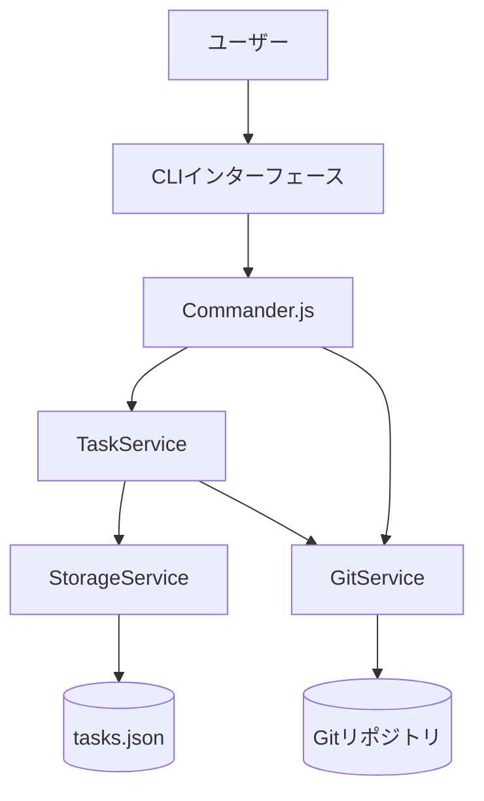
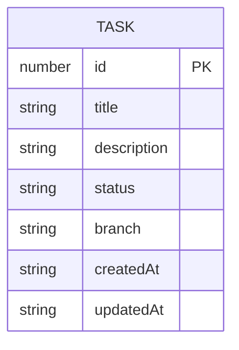
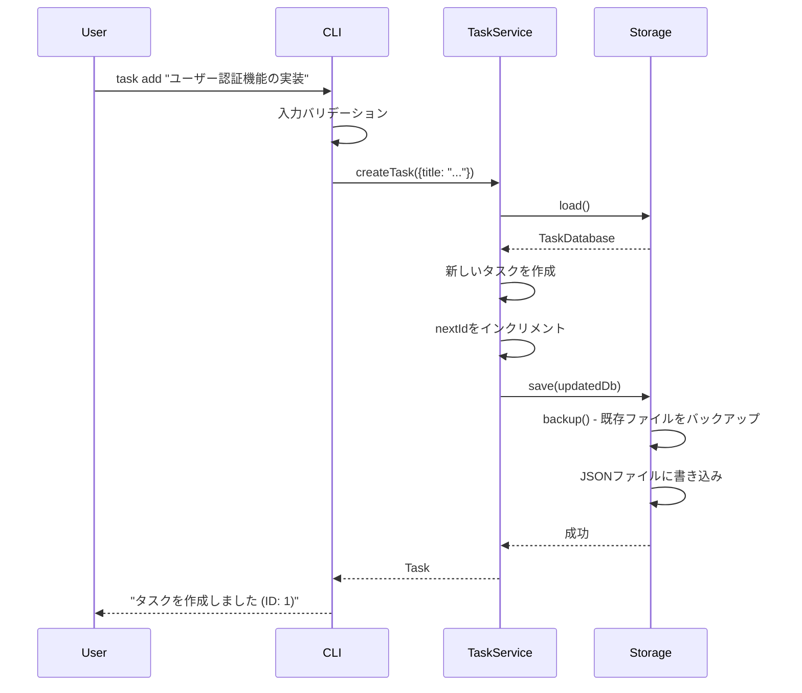
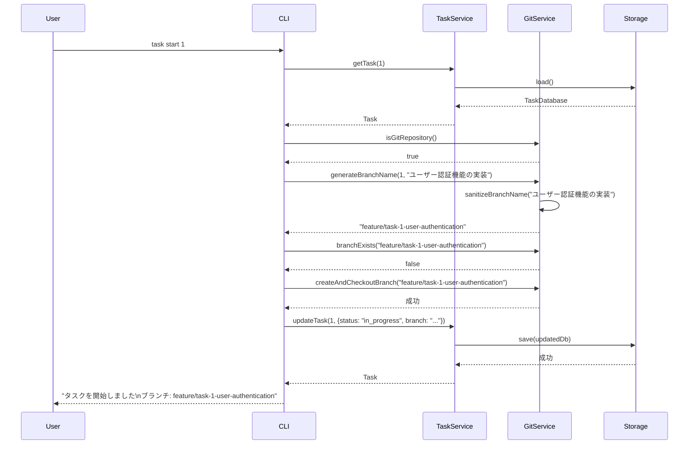
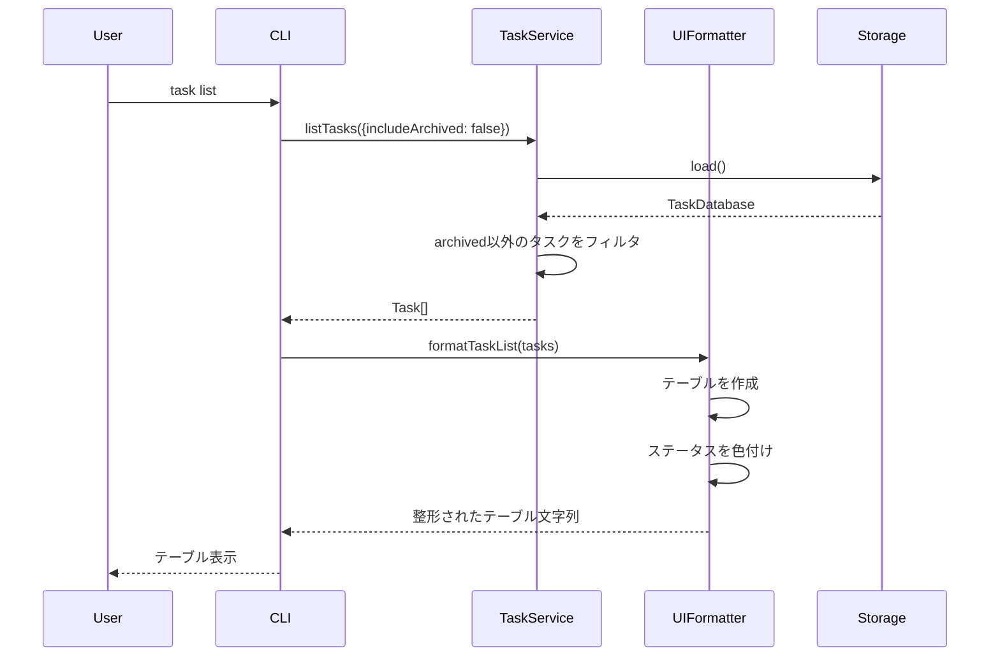
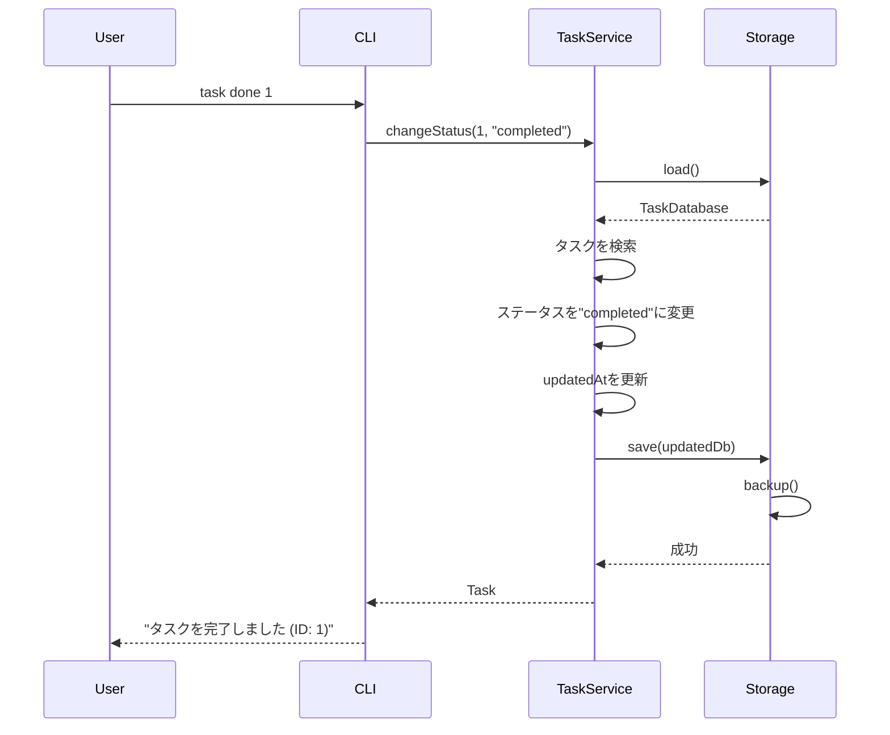

# 機能設計書 (Functional Design Document)

## システム構成図



**アーキテクチャパターン**: 3層アーキテクチャ
- **プレゼンテーション層**: CLIインターフェース、Commander.js
- **ビジネスロジック層**: TaskService、GitService
- **データアクセス層**: StorageService

## 技術スタック

| 分類 | 技術 | 選定理由 |
|------|------|----------|
| 言語 | TypeScript 5.x | 型安全性、開発効率、エコシステムの充実 |
| ランタイム | Node.js 18+ | クロスプラットフォーム対応、npmエコシステム |
| CLIフレームワーク | Commander.js | シンプル、学習コストが低い、十分な機能 |
| Git連携 | simple-git | Node.jsで使いやすい、安定している |
| テーブル表示 | cli-table3 | カスタマイズ性が高い、Unicode対応 |
| カラー出力 | chalk | 広く使われている、シンプルなAPI |
| データ形式 | JSON | 人間が読みやすい、Git管理可能、標準ライブラリで扱える |
| テストフレームワーク | Vitest | 高速、TypeScript対応、モダンなAPI |
| パッケージマネージャ | npm | 標準、広く使われている |

## データモデル定義

### エンティティ: Task

```typescript
interface Task {
  id: number;                   // タスクID（1から自動採番）
  title: string;                // タスクタイトル（1-200文字）
  description?: string;         // タスクの詳細説明（オプション、Markdown形式）
  status: TaskStatus;           // タスクのステータス
  branch?: string;              // 関連するGitブランチ名（task start実行後に設定）
  createdAt: string;            // 作成日時（ISO 8601形式）
  updatedAt: string;            // 更新日時（ISO 8601形式）
}

type TaskStatus = 'open' | 'in_progress' | 'completed' | 'archived';
```

**制約**:
- `id`: 1から開始、自動採番、重複不可
- `title`: 必須、1-200文字
- `description`: オプション、制限なし
- `status`: 必須、4つの値のいずれか
- `branch`: `task start`実行時に自動設定、形式は`feature/task-{id}-{sanitized-title}`
- `createdAt`, `updatedAt`: ISO 8601形式（例: `2025-01-15T10:30:00.000Z`）

### エンティティ: TaskDatabase

```typescript
interface TaskDatabase {
  tasks: Task[];                // タスクの配列
  nextId: number;               // 次に採番されるタスクID
}
```

**制約**:
- `tasks`: 空配列も許可
- `nextId`: 1から開始、タスク作成ごとにインクリメント

### ER図



**備考**: MVPでは単一エンティティのみ。将来的にタグやサブタスクを追加する場合はER図を拡張。

## コンポーネント設計

### 1. CLIインターフェース (src/cli/index.ts)

**責務**:
- ユーザーからのコマンド入力を受け付ける
- Commander.jsを初期化し、コマンドを登録する
- 実行結果をフォーマットして表示する
- エラーメッセージを表示する

**インターフェース**:
```typescript
class CLI {
  // CLIアプリケーションを初期化
  initialize(): void;

  // コマンドを実行
  run(args: string[]): Promise<void>;
}
```

**依存関係**:
- Commander.js
- TaskService
- GitService
- UIFormatter

### 2. TaskService (src/services/TaskService.ts)

**責務**:
- タスクのCRUD操作
- タスクのステータス管理
- タスクのバリデーション

**インターフェース**:
```typescript
class TaskService {
  // タスクを作成
  createTask(data: CreateTaskInput): Task;

  // タスク一覧を取得
  listTasks(options?: ListOptions): Task[];

  // タスクを取得
  getTask(id: number): Task | null;

  // タスクを更新
  updateTask(id: number, data: UpdateTaskInput): Task;

  // タスクのステータスを変更
  changeStatus(id: number, status: TaskStatus): Task;

  // タスクを削除
  deleteTask(id: number): void;

  // タスクをアーカイブ
  archiveTask(id: number): Task;
}

interface CreateTaskInput {
  title: string;
  description?: string;
}

interface UpdateTaskInput {
  title?: string;
  description?: string;
  status?: TaskStatus;
  branch?: string;
}

interface ListOptions {
  status?: TaskStatus;
  includeArchived?: boolean;
}
```

**依存関係**:
- StorageService

### 3. GitService (src/services/GitService.ts)

**責務**:
- Gitリポジトリの存在確認
- ブランチの作成と切り替え
- ブランチ名のサニタイズ

**インターフェース**:
```typescript
class GitService {
  // Gitリポジトリが存在するか確認
  isGitRepository(): boolean;

  // ブランチを作成して切り替え
  createAndCheckoutBranch(branchName: string): void;

  // ブランチが存在するか確認
  branchExists(branchName: string): boolean;

  // ブランチに切り替え
  checkoutBranch(branchName: string): void;

  // タスクIDとタイトルからブランチ名を生成
  generateBranchName(taskId: number, taskTitle: string): string;

  // 文字列をブランチ名に適した形式にサニタイズ
  sanitizeBranchName(text: string): string;
}
```

**依存関係**:
- simple-git

### 4. StorageService (src/services/StorageService.ts)

**責務**:
- JSONファイルへのデータ保存
- JSONファイルからのデータ読み込み
- ファイルの存在確認
- バックアップの作成

**インターフェース**:
```typescript
class StorageService {
  // データベースを読み込む
  load(): TaskDatabase;

  // データベースを保存
  save(db: TaskDatabase): void;

  // ファイルが存在するか確認
  exists(): boolean;

  // データディレクトリを初期化
  initialize(): void;

  // バックアップを作成
  backup(): void;
}
```

**依存関係**:
- Node.js fs module

### 5. UIFormatter (src/ui/UIFormatter.ts)

**責務**:
- タスク一覧をテーブル形式で整形
- ステータスや優先度を色付けして表示
- エラーメッセージを整形

**インターフェース**:
```typescript
class UIFormatter {
  // タスク一覧をテーブル形式で整形
  formatTaskList(tasks: Task[]): string;

  // 単一タスクの詳細を整形
  formatTaskDetail(task: Task): string;

  // 成功メッセージを整形
  formatSuccess(message: string): string;

  // エラーメッセージを整形
  formatError(message: string): string;

  // ステータスを色付きで整形
  formatStatus(status: TaskStatus): string;
}
```

**依存関係**:
- cli-table3
- chalk

## ユースケース図

### ユースケース1: タスクを作成する



**フロー説明**:
1. ユーザーが `task add "タイトル"` コマンドを実行
2. CLIがタイトルのバリデーション（1-200文字）を実行
3. TaskServiceがStorageからデータベースを読み込み
4. 新しいタスクオブジェクトを作成（ステータスは`open`）
5. nextIdをインクリメント
6. Storageがバックアップを作成し、データを保存
7. 成功メッセージを表示

### ユースケース2: タスクを開始する（Git連携）



**フロー説明**:
1. ユーザーが `task start <id>` コマンドを実行
2. タスクが存在するか確認
3. Gitリポジトリが存在するか確認
4. ブランチ名を生成（`feature/task-{id}-{sanitized-title}`）
5. ブランチが既に存在する場合は切り替えのみ、存在しない場合は作成して切り替え
6. タスクのステータスを`in_progress`に更新、ブランチ名を保存
7. 成功メッセージを表示

### ユースケース3: タスク一覧を表示する



**フロー説明**:
1. ユーザーが `task list` コマンドを実行
2. TaskServiceがタスク一覧を取得（デフォルトでは`archived`を除外）
3. UIFormatterがテーブル形式に整形
4. ステータスごとに色付けして表示

### ユースケース4: タスクを完了する



**フロー説明**:
1. ユーザーが `task done <id>` コマンドを実行
2. タスクが存在するか確認
3. ステータスを`completed`に変更
4. `updatedAt`を現在時刻に更新
5. データを保存
6. 成功メッセージを表示

## UI設計

### テーブル表示

**表示項目**:
| 項目 | 説明 | フォーマット |
|------|------|-------------|
| ID | タスクID | 数値 |
| Status | ステータス | 色付きテキスト（後述） |
| Title | タスクタイトル | 文字列（長い場合は切り詰め） |
| Branch | Gitブランチ名 | 文字列、未設定の場合は"-" |

**表示例**:
```
ID  Status       Title                          Branch
1   in_progress  ユーザー認証機能の実装          feature/task-1-user-authentication
2   open         データエクスポート機能          -
3   completed    初期セットアップ               feature/task-3-initial-setup
```

### カラーコーディング

**ステータスの色分け**:
- `open`: 白（デフォルト色）
- `in_progress`: 黄色（chalk.yellow）
- `completed`: 緑色（chalk.green）
- `archived`: グレー（chalk.gray）

**実装例**:
```typescript
function formatStatus(status: TaskStatus): string {
  switch (status) {
    case 'open':
      return chalk.white('open');
    case 'in_progress':
      return chalk.yellow('in_progress');
    case 'completed':
      return chalk.green('completed');
    case 'archived':
      return chalk.gray('archived');
  }
}
```

### タスク詳細表示

**表示項目**:
```
Task #1
━━━━━━━━━━━━━━━━━━━━━━━━━━━━━━━━━━━━━━━━
Title:       ユーザー認証機能の実装
Status:      in_progress
Branch:      feature/task-1-user-authentication
Created:     2025-01-15 10:30:00
Updated:     2025-01-15 14:20:00

Description:
JWT認証を実装する
- ログインエンドポイント
- トークン検証ミドルウェア
━━━━━━━━━━━━━━━━━━━━━━━━━━━━━━━━━━━━━━━━
```

## ファイル構造

### プロジェクト構造

```
taskcli/
├── src/
│   ├── cli/
│   │   └── index.ts           # CLIエントリーポイント
│   ├── services/
│   │   ├── TaskService.ts     # タスク管理ビジネスロジック
│   │   ├── GitService.ts      # Git連携ロジック
│   │   └── StorageService.ts  # データ永続化ロジック
│   ├── ui/
│   │   └── UIFormatter.ts     # UI整形ロジック
│   ├── types/
│   │   └── index.ts           # 型定義
│   └── index.ts               # メインエントリーポイント
├── tests/
│   ├── services/
│   │   ├── TaskService.test.ts
│   │   ├── GitService.test.ts
│   │   └── StorageService.test.ts
│   └── ui/
│       └── UIFormatter.test.ts
├── .task/                     # データディレクトリ（Gitignore）
│   ├── tasks.json             # タスクデータ
│   └── tasks.json.bak         # バックアップ
├── package.json
├── tsconfig.json
├── vitest.config.ts
└── README.md
```

### データ保存形式

**ディレクトリ**: `.task/`
- ユーザーのカレントディレクトリ直下に作成
- `.gitignore`に追加を推奨（ただし強制はしない）

**ファイル**: `.task/tasks.json`

**ファイル内容例**:
```json
{
  "tasks": [
    {
      "id": 1,
      "title": "ユーザー認証機能の実装",
      "description": "JWT認証を実装する\n- ログインエンドポイント\n- トークン検証ミドルウェア",
      "status": "in_progress",
      "branch": "feature/task-1-user-authentication",
      "createdAt": "2025-01-15T10:30:00.000Z",
      "updatedAt": "2025-01-15T14:20:00.000Z"
    },
    {
      "id": 2,
      "title": "データエクスポート機能",
      "status": "open",
      "createdAt": "2025-01-15T11:00:00.000Z",
      "updatedAt": "2025-01-15T11:00:00.000Z"
    }
  ],
  "nextId": 3
}
```

**初期状態**（ファイルが存在しない場合）:
```json
{
  "tasks": [],
  "nextId": 1
}
```

## パフォーマンス最適化

- **遅延読み込み**: データファイルはコマンド実行時にのみ読み込む
- **メモリ効率**: タスクデータは必要な時だけメモリに保持、処理後はすぐに解放
- **ファイルI/O最適化**: バックアップとデータ保存を同期的に実行し、データ損失を防ぐ
- **Git操作の最適化**: simple-gitのキャッシュ機能を活用し、リポジトリ情報の取得を高速化

**パフォーマンス目標**（PRDから）:
- コマンド実行時間: 100ms以内
- タスク一覧表示: 1000件でも1秒以内

## セキュリティ考慮事項

- **入力バリデーション**: すべてのユーザー入力をバリデーションし、不正な値を拒否
  - タスクタイトル: 1-200文字
  - タスクID: 正の整数のみ許可
- **パストラバーサル対策**: データディレクトリは固定（`.task/`）、ユーザー指定のパスは許可しない
- **JSONパース**: JSON.parseのエラーハンドリングを適切に実装し、破損したファイルでも安全に処理
- **コマンドインジェクション対策**: simple-gitを使用し、直接シェルコマンドを実行しない

## エラーハンドリング

### エラーの分類

| エラー種別 | 処理 | ユーザーへの表示 | 終了コード |
|-----------|------|-----------------|-----------|
| タスクが見つからない | 処理を中断 | "タスクが見つかりません (ID: {id})" | 1 |
| 入力検証エラー | 処理を中断 | "タイトルは1-200文字で入力してください" | 1 |
| Gitリポジトリが存在しない | 処理を中断 | "Gitリポジトリが見つかりません。`git init`を実行してください" | 1 |
| ファイル読み込みエラー | 空のデータで初期化 | "データファイルが見つかりません。新規作成します" | 0 |
| ファイル書き込みエラー | 処理を中断 | "データの保存に失敗しました: {エラー内容}" | 1 |
| JSONパースエラー | 処理を中断 | "データファイルが破損しています。バックアップから復元してください" | 1 |
| Git操作エラー | 処理を中断 | "ブランチの作成に失敗しました: {エラー内容}" | 1 |
| 不明なエラー | 処理を中断 | "予期しないエラーが発生しました: {エラー内容}" | 1 |

### エラーハンドリング実装例

```typescript
// TaskServiceのエラーハンドリング
class TaskService {
  getTask(id: number): Task {
    const db = this.storage.load();
    const task = db.tasks.find(t => t.id === id);

    if (!task) {
      throw new TaskNotFoundError(`タスクが見つかりません (ID: ${id})`);
    }

    return task;
  }

  createTask(data: CreateTaskInput): Task {
    // タイトルのバリデーション
    if (!data.title || data.title.length < 1 || data.title.length > 200) {
      throw new ValidationError('タイトルは1-200文字で入力してください');
    }

    // ... タスク作成処理
  }
}

// カスタムエラークラス
class TaskNotFoundError extends Error {
  constructor(message: string) {
    super(message);
    this.name = 'TaskNotFoundError';
  }
}

class ValidationError extends Error {
  constructor(message: string) {
    super(message);
    this.name = 'ValidationError';
  }
}

// CLIでのエラーハンドリング
try {
  // コマンド実行
} catch (error) {
  if (error instanceof TaskNotFoundError) {
    console.error(chalk.red(error.message));
    process.exit(1);
  } else if (error instanceof ValidationError) {
    console.error(chalk.red(error.message));
    process.exit(1);
  } else {
    console.error(chalk.red(`予期しないエラーが発生しました: ${error.message}`));
    process.exit(1);
  }
}
```

## テスト戦略

### ユニットテスト

**対象**:
- **TaskService**: 各メソッドの動作を検証
  - `createTask`: タスク作成、バリデーション、ID採番
  - `listTasks`: フィルタリング、ソート
  - `getTask`: 存在するタスクの取得、存在しないタスクのエラー
  - `updateTask`: 更新処理、バリデーション
  - `changeStatus`: ステータス変更、updatedAt更新
  - `deleteTask`: 削除処理、エラーハンドリング

- **GitService**: Git操作のモック化
  - `isGitRepository`: Gitリポジトリの存在確認
  - `generateBranchName`: ブランチ名生成、サニタイズ
  - `createAndCheckoutBranch`: ブランチ作成、切り替え

- **StorageService**: ファイルI/Oのモック化
  - `load`: ファイル読み込み、JSONパース
  - `save`: ファイル書き込み、バックアップ
  - `initialize`: ディレクトリ作成

- **UIFormatter**: 表示フォーマットの検証
  - `formatTaskList`: テーブル整形
  - `formatStatus`: 色付け

**ツール**: Vitest

### 統合テスト

**シナリオ**:
1. **タスク作成から完了までのフロー**
   - タスク作成 → 一覧表示 → タスク開始 → 完了
   - データの永続化を確認
   - Git操作（ブランチ作成）を確認

2. **エラーハンドリング**
   - 存在しないタスクIDを指定
   - 不正な入力値を与える
   - Gitリポジトリがない状態で`task start`を実行

3. **データの整合性**
   - 複数のタスクを作成してID採番を確認
   - タスク削除後のID採番を確認

**ツール**: Vitest

### E2Eテスト

**シナリオ**:
1. **基本的な使用フロー**
   - CLIをインストール
   - `task add`でタスクを作成
   - `task list`で一覧表示
   - `task start`でタスクを開始（ブランチ作成確認）
   - `task done`でタスクを完了
   - `task list`で完了状態を確認

2. **Git連携**
   - Gitリポジトリを初期化
   - タスクを開始してブランチが作成されることを確認
   - 既存ブランチでタスクを開始した場合の動作確認

3. **クロスプラットフォーム**
   - macOS、Linux、Windows(Git Bash)で基本操作を実行
   - 各環境でファイルパスが正しく扱われることを確認

**ツール**: Vitest + 実際のCLI実行

### テストカバレッジ目標

- **ユニットテスト**: 90%以上
- **統合テスト**: 主要なユースケースをカバー
- **E2Eテスト**: 基本フローとエラーケースをカバー

## ブランチ名サニタイズの詳細

### サニタイズルール

**目的**: タスクタイトルをGitブランチ名として使える形式に変換する

**変換ルール**:
1. 小文字に変換
2. スペースをハイフン(-)に変換
3. 英数字とハイフン以外の文字を削除
4. 連続するハイフンを1つにまとめる
5. 先頭と末尾のハイフンを削除
6. 最大長を50文字に制限

**実装例**:
```typescript
sanitizeBranchName(text: string): string {
  return text
    .toLowerCase()                       // 小文字化
    .replace(/\s+/g, '-')                // スペース → ハイフン
    .replace(/[^a-z0-9-]/g, '')          // 英数字とハイフン以外を削除
    .replace(/-+/g, '-')                 // 連続ハイフン → 1つ
    .replace(/^-+|-+$/g, '')             // 先頭と末尾のハイフンを削除
    .substring(0, 50);                   // 最大50文字
}
```

**変換例**:
- `"ユーザー認証機能の実装"` → `""` (日本語は削除される)
- `"Implement User Authentication"` → `"implement-user-authentication"`
- `"Fix bug #123"` → `"fix-bug-123"`
- `"Add  multiple   spaces"` → `"add-multiple-spaces"`

**日本語タイトルの対応**:
日本語タイトルの場合、サニタイズ後に空文字列になる可能性がある。
その場合は、タスクIDのみを使用したブランチ名にフォールバック:
```typescript
generateBranchName(taskId: number, taskTitle: string): string {
  const sanitized = this.sanitizeBranchName(taskTitle);

  if (sanitized.length === 0) {
    return `feature/task-${taskId}`;
  }

  return `feature/task-${taskId}-${sanitized}`;
}
```

**変換例（フォールバック）**:
- タスクID: 1, タイトル: `"ユーザー認証機能の実装"` → `"feature/task-1"`
