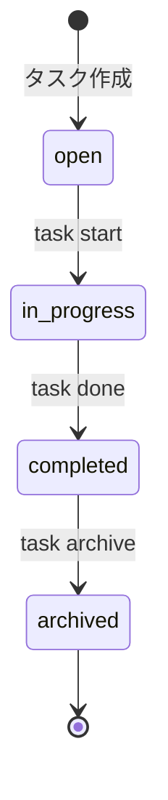

# プロジェクト用語集 (Glossary)

## 概要

このドキュメントは、TaskCLIプロジェクトで使用される用語の定義を管理します。

**更新日**: 2025-01-15

## ドメイン用語

プロジェクト固有のビジネス概念や機能に関する用語。

### タスク (Task)

**定義**: ユーザーが完了すべき作業の単位。ID、タイトル、説明、ステータス、ブランチ名、作成日時、更新日時を持つ。

**説明**:
タスクはTaskCLIの中心的な概念です。各タスクは一意のID（数値）で識別され、open → in_progress → completedのライフサイクルを持ちます。タスクを開始すると、自動的にGitブランチが作成され、作業との紐付けが行われます。

**関連用語**:
- [タスクステータス](#タスクステータス-task-status): タスクの進行状態
- [ブランチ](#gitブランチ-git-branch): タスクに紐付くGitブランチ

**使用例**:
- 「タスクを作成する」: `task add "新機能の実装"`
- 「タスクを開始する」: `task start 1`
- 「タスクを完了する」: `task done 1`

**データモデル**: `src/types/Task.ts`

**英語表記**: Task

### タスクステータス (Task Status)

**定義**: タスクの進行状態を示す4つの列挙値（open、in_progress、completed、archived）。

**説明**:
タスクステータスは、タスクのライフサイクルを表現します。タスク作成時はopenで開始し、ユーザーの操作によって遷移します。

**ステータス一覧**:

| ステータス | 意味 | 遷移条件 | 次の状態 | 色表示 |
|----------|------|---------|---------|--------|
| `open` | 未着手 | タスク作成時の初期状態 | `in_progress` | 白 |
| `in_progress` | 作業中 | `task start` コマンド実行 | `completed` | 黄 |
| `completed` | 完了 | `task done` コマンド実行 | `archived` | 緑 |
| `archived` | アーカイブ済み | `task archive` コマンド実行 | - | グレー |

**状態遷移図**:


**ビジネスルール**:
- `open` → `completed` への直接遷移は禁止
- `archived` 状態からの遷移は不可（読み取り専用）
- デフォルトの一覧表示では`archived`は除外される

**実装**: `src/types/Task.ts`

**英語表記**: Task Status

### Gitブランチ (Git Branch)

**定義**: タスクに紐付けられるGitのブランチ。`feature/task-{id}-{sanitized-title}` の形式で自動生成される。

**説明**:
`task start` コマンドを実行すると、タスクIDとタイトルから自動的にブランチ名が生成され、Gitブランチが作成されます。タイトルは英数字とハイフンのみに変換（サニタイズ）されます。

**命名規則**:
- プレフィックス: `feature/`
- フォーマット: `task-{id}-{sanitized-title}`
- 最大長: 50文字

**サニタイズルール**:
1. 小文字に変換
2. スペースをハイフン(-)に変換
3. 英数字とハイフン以外の文字を削除
4. 連続するハイフンを1つにまとめる
5. 先頭と末尾のハイフンを削除

**使用例**:
```bash
# タスクID: 1, タイトル: "Implement User Authentication"
# → ブランチ名: feature/task-1-implement-user-authentication

# タスクID: 2, タイトル: "ユーザー認証機能の実装"
# → ブランチ名: feature/task-2 (日本語は削除される)
```

**関連用語**:
- [タスク](#タスク-task): ブランチに紐付くタスク
- [GitService](#gitservice): ブランチ操作を担当するサービス

**実装**: `src/services/GitService.ts`

**英語表記**: Git Branch

### ステアリングファイル (Steering File)

**定義**: 特定の開発作業における「今回何をするか」を定義する作業単位のドキュメント。

**説明**:
ステアリングファイルは `.steering/[YYYYMMDD]-[task-name]/` ディレクトリに配置され、特定のタスクに関する要求内容、設計、タスクリストを含みます。タスク完了後も履歴として保持されます。

**ディレクトリ構造**:
```
.steering/
└── 20250115-add-git-integration/
    ├── requirements.md    # 今回の作業の要求内容
    ├── design.md          # 変更内容の設計
    └── tasklist.md        # タスクリスト
```

**命名規則**:
- フォーマット: `YYYYMMDD-[task-name]`
- task-name: kebab-case

**関連用語**:
- [永続ドキュメント](#永続ドキュメント-persistent-documents): プロジェクト全体の設計ドキュメント

**使用例**:
- 「機能追加のためにステアリングファイルを作成する」
- 「タスク完了後、ステアリングファイルを履歴として保持する」

**英語表記**: Steering File

### 永続ドキュメント (Persistent Documents)

**定義**: プロジェクト全体の「何を作るか」「どう作るか」を定義する長期保存ドキュメント。

**説明**:
`docs/` ディレクトリに配置される6つのドキュメントで、プロジェクトの基本設計を記述します。頻繁に更新されず、プロジェクトの「北極星」として機能します。

**ドキュメント一覧**:
- `product-requirements.md`: プロダクト要求定義書（PRD）
- `functional-design.md`: 機能設計書
- `architecture.md`: アーキテクチャ設計書
- `repository-structure.md`: リポジトリ構造定義書
- `development-guidelines.md`: 開発ガイドライン
- `glossary.md`: 用語集（本ドキュメント）

**関連用語**:
- [ステアリングファイル](#ステアリングファイル-steering-file): 作業単位の一時ドキュメント

**英語表記**: Persistent Documents

## 技術用語

プロジェクトで使用している技術・フレームワーク・ツールに関する用語。

### TypeScript

**定義**: JavaScriptに静的型付けを追加したプログラミング言語。Microsoftが開発。

**公式サイト**: https://www.typescriptlang.org/

**本プロジェクトでの用途**:
全てのソースコードをTypeScriptで記述し、型安全性を確保しています。

**バージョン**: 5.x

**選定理由**:
- コンパイル時のエラー検出による品質向上
- エディタの補完機能による開発効率向上
- チーム開発における型定義の共有

**関連ドキュメント**:
- [アーキテクチャ設計書](./architecture.md#技術スタック)
- [開発ガイドライン](./development-guidelines.md#型定義)

**設定ファイル**: `tsconfig.json`

### Node.js

**定義**: V8 JavaScriptエンジンで動作するJavaScriptランタイム環境。

**公式サイト**: https://nodejs.org/

**本プロジェクトでの用途**:
CLIツールの実行環境として使用。ファイルI/O、プロセス管理、外部コマンド実行を行います。

**バージョン**: v24.11.0 (LTS)

**選定理由**:
- 2026年4月までの長期サポート保証
- クロスプラットフォーム対応（macOS、Linux、Windows）
- npmエコシステムの充実

**関連ドキュメント**: [アーキテクチャ設計書](./architecture.md#技術スタック)

### Commander.js

**定義**: Node.js向けのCLIフレームワーク。コマンドライン引数の解析とコマンド定義を簡素化。

**公式サイト**: https://github.com/tj/commander.js

**本プロジェクトでの用途**:
CLIコマンドの定義、オプションの解析、ヘルプ生成に使用。

**バージョン**: ^12.0.0

**選定理由**:
- シンプルで学習コストが低い
- TypeScript型定義が充実
- サブコマンド対応

**代替技術**:
- oclif: 多機能すぎて学習コストが高い
- yargs: Commanderの方がシンプルで直感的

**実装**: `src/cli/index.ts`

### simple-git

**定義**: Node.jsからGitコマンドを実行するためのライブラリ。

**公式サイト**: https://github.com/steveukx/git-js

**本プロジェクトでの用途**:
Gitリポジトリの存在確認、ブランチ作成・切り替えを行います。

**バージョン**: ^3.25.0

**選定理由**:
- Promiseベースで非同期処理が書きやすい
- エラーハンドリングが充実
- TypeScript型定義あり

**代替技術**:
- nodegit: ネイティブバインディングが必要で導入が複雑

**実装**: `src/services/GitService.ts`

### Vitest

**定義**: Vitベースの高速なTypeScriptテストフレームワーク。

**公式サイト**: https://vitest.dev/

**本プロジェクトでの用途**:
ユニットテスト、統合テスト、E2Eテストの実行とカバレッジ測定。

**バージョン**: ^2.0.0

**選定理由**:
- Jestよりも高速（Vitベースのトランスパイル）
- TypeScriptのESMに対応
- Jestと互換性のあるAPI

**カバレッジ目標**: 90%以上

**設定ファイル**: `vitest.config.ts`

### chalk

**定義**: ターミナルでの色付け表示を行うNode.jsライブラリ。

**公式サイト**: https://github.com/chalk/chalk

**本プロジェクトでの用途**:
タスクステータスの色分け表示、成功/エラーメッセージの装飾。

**バージョン**: 5.3.0 (ESM専用)

**色の使い分け**:
- 白: `open` ステータス
- 黄: `in_progress` ステータス
- 緑: `completed` ステータス、成功メッセージ
- グレー: `archived` ステータス
- 赤: エラーメッセージ

**実装**: `src/ui/UIFormatter.ts`

## 略語・頭字語

### CLI

**正式名称**: Command Line Interface

**意味**: コマンドラインから操作するインターフェース

**本プロジェクトでの使用**:
TaskCLIツールのメインインターフェース。ユーザーは `task add "タスク"` のようなコマンドでタスクを操作します。

**実装**: `src/cli/` ディレクトリ

**代替インターフェース**: GUI版の実装は将来の拡張として検討中（P2）

### PRD

**正式名称**: Product Requirements Document

**意味**: プロダクト要求定義書

**本プロジェクトでの使用**:
`docs/product-requirements.md` として保存される永続ドキュメント。プロダクトビジョン、ターゲットユーザー、機能要件、成功指標を定義します。

**関連**: `/setup-project` コマンドで最初に作成されるドキュメント

### MVP

**正式名称**: Minimum Viable Product

**意味**: 最小限の機能を持つ製品

**本プロジェクトでの使用**:
P0（必須）の機能のみを実装した最初のリリース版。タスクの基本CRUD操作、Git連携、ステータス管理を含みます。

**関連**: PRDの機能要件で優先度P0として定義

### TDD

**正式名称**: Test-Driven Development

**意味**: テスト駆動開発。テストを先に書いてから実装を行う開発手法。

**本プロジェクトでの適用**:
全ての新機能開発でTDDを推奨しています。

**手順**:
1. テストを書く
2. テストを実行 → 失敗を確認
3. 実装を書く
4. テストを実行 → 成功を確認
5. リファクタリング

**参考**: [開発ガイドライン](./development-guidelines.md#テスト戦略)

### DI

**正式名称**: Dependency Injection

**意味**: 依存性注入。オブジェクトの依存関係を外部から注入する設計パターン。

**本プロジェクトでの適用**:
`src/index.ts` でサービスの依存関係を構築し、CLIに注入します。

**使用例**:
```typescript
// 依存関係の構築
const storageService = new StorageService('.task');
const gitService = new GitService();
const taskService = new TaskService(storageService, gitService);

// CLIに注入
const cli = new CLI(taskService, gitService);
```

**メリット**:
- テストが容易（モックに差し替え可能）
- 疎結合な設計

## アーキテクチャ用語

システム設計・アーキテクチャに関する用語。

### レイヤードアーキテクチャ (Layered Architecture)

**定義**: システムを役割ごとに複数の層に分割し、上位層から下位層への一方向の依存関係を持たせる設計パターン。

**本プロジェクトでの適用**:
3層アーキテクチャを採用しています:

```
プレゼンテーション層 (cli/, ui/)
    ↓
ビジネスロジック層 (services/)
    ↓
データアクセス層 (StorageService)
```

**各層の責務**:
- **プレゼンテーション層**: ユーザー入力の受付、結果の表示、バリデーション
- **ビジネスロジック層**: タスク管理、Git操作、ビジネスルールの実装
- **データアクセス層**: JSONファイルへのデータ保存・読み込み

**依存関係のルール**:
- ✅ プレゼンテーション層 → ビジネスロジック層
- ✅ ビジネスロジック層 → データアクセス層
- ❌ データアクセス層 → ビジネスロジック層
- ❌ データアクセス層 → プレゼンテーション層

**メリット**:
- 関心の分離による保守性向上
- 各層を独立してテスト可能
- 変更の影響範囲が限定的

**関連ドキュメント**:
- [アーキテクチャ設計書](./architecture.md#アーキテクチャパターン)
- [リポジトリ構造定義書](./repository-structure.md)

### サービス層 (Service Layer)

**定義**: ビジネスロジックを実装するレイヤー。UIとデータ層の中間に位置する。

**本プロジェクトでの実装**:
`src/services/` ディレクトリに配置されるクラス群。

**主要サービス**:
- **TaskService**: タスクのCRUD操作、ステータス管理
- **GitService**: Git操作（ブランチ作成、切り替え、サニタイズ）
- **StorageService**: データ永続化（JSON読み書き、バックアップ）

**責務**:
- ビジネスロジックの実装
- データ変換
- 他のサービスの呼び出し

**禁止事項**:
- プレゼンテーション層への依存（console.logなど）
- 直接的なファイルI/O（StorageServiceを経由）

**実装例**:
```typescript
class TaskService {
  constructor(
    private storage: StorageService,
    private git: GitService
  ) {}

  createTask(data: CreateTaskInput): Task {
    // ビジネスロジックの実装
  }
}
```

### データアクセス層 (Data Access Layer)

**定義**: データの永続化と取得を担当するレイヤー。

**本プロジェクトでの実装**:
`StorageService` クラスがこの層を担当。

**責務**:
- JSONファイルへのデータ保存
- JSONファイルからのデータ読み込み
- ファイルの存在確認
- バックアップの作成

**禁止事項**:
- ビジネスロジックの実装
- データの変換（タスクオブジェクトの構築など）

**実装**: `src/services/StorageService.ts`

## データモデル用語

データベース・データ構造に関する用語。

### Task

**定義**: タスクを表すデータモデル。

**主要フィールド**:
- `id`: number - タスクID（1から自動採番）
- `title`: string - タスクタイトル（1-200文字、必須）
- `description`: string | undefined - タスクの詳細説明（オプション）
- `status`: TaskStatus - タスクステータス（必須）
- `branch`: string | undefined - 関連するGitブランチ名（オプション）
- `createdAt`: string - 作成日時（ISO 8601形式）
- `updatedAt`: string - 更新日時（ISO 8601形式）

**制約**:
- `id`: 重複不可、正の整数
- `title`: 1-200文字、必須
- `status`: TaskStatusの4つの値のいずれか
- `createdAt`, `updatedAt`: ISO 8601形式（例: `2025-01-15T10:30:00.000Z`）

**実装**: `src/types/Task.ts`

### TaskDatabase

**定義**: タスクデータベースを表すデータモデル。JSONファイルとして保存される。

**主要フィールド**:
- `tasks`: Task[] - タスクの配列
- `nextId`: number - 次に採番されるタスクID

**ファイルパス**: `.task/tasks.json`

**初期状態**:
```json
{
  "tasks": [],
  "nextId": 1
}
```

**実装**: `src/types/Database.ts`

## エラー・例外

システムで定義されているエラーと例外。

### ValidationError

**クラス名**: `ValidationError`

**継承元**: `Error`

**発生条件**:
ユーザー入力がビジネスルールに違反した場合に発生します。

**エラーメッセージフォーマット**:
```
[エラー内容] (フィールド: [field])
```

**対処方法**:
- ユーザー: エラーメッセージに従って入力を修正
- 開発者: バリデーションロジックが正しいか確認

**ログレベル**: WARN（ユーザー起因のエラーのため）

**実装箇所**: カスタムエラークラスとして実装予定

**使用例**:
```typescript
// エラーのスロー
if (title.length === 0) {
  throw new ValidationError(
    'タイトルは必須です',
    'title',
    title
  );
}

// エラーのハンドリング
try {
  await taskService.createTask(data);
} catch (error) {
  if (error instanceof ValidationError) {
    console.error(chalk.red(`入力エラー: ${error.message}`));
  }
}
```

**関連するバリデーション**:
- タイトル: 1-200文字
- タスクID: 正の整数

### TaskNotFoundError

**クラス名**: `TaskNotFoundError`

**継承元**: `Error`

**発生条件**:
指定されたIDのタスクが存在しない場合に発生します。

**エラーメッセージフォーマット**:
```
タスクが見つかりません (ID: [taskId])
```

**対処方法**:
- ユーザー: `task list` で存在するタスクIDを確認
- 開発者: タスクの削除処理が正しいか確認

**ログレベル**: WARN

**実装箇所**: カスタムエラークラスとして実装予定

**使用例**:
```typescript
function getTask(id: number): Task {
  const task = db.tasks.find(t => t.id === id);

  if (!task) {
    throw new TaskNotFoundError(id);
  }

  return task;
}
```

### StorageError

**クラス名**: `StorageError`

**継承元**: `Error`

**発生条件**:
ファイルの読み書きに失敗した場合に発生します。

**エラーメッセージフォーマット**:
```
データの[読み込み|保存]に失敗しました: [詳細]
```

**対処方法**:
- ユーザー: ファイルのアクセス権限を確認、ディスク容量を確認
- 開発者: ファイルパスが正しいか確認、エラーログを確認

**ログレベル**: ERROR

**実装箇所**: カスタムエラークラスとして実装予定

## 開発プロセス用語

Git運用、テスト、レビューに関する用語。

### Git Flow

**定義**: Vincent Driessenが提唱したブランチ戦略。機能開発、リリース、ホットフィックスを体系的に管理する。

**本プロジェクトでの適用**:
```
main (本番環境)
└── dev (開発環境)
    ├── feature/* (新機能開発)
    ├── fix/* (バグ修正)
    └── refactor/* (リファクタリング)
```

**ブランチの役割**:
- **main**: 本番リリース済みの安定版コード
- **dev**: 次期リリースに向けた開発コード
- **feature/\***: 新機能開発用ブランチ
- **fix/\***: バグ修正用ブランチ

**メリット**:
- ブランチの役割が明確
- 複数人での並行開発がしやすい
- 本番環境が常にクリーンな状態

**関連ドキュメント**: [開発ガイドライン](./development-guidelines.md#Git運用ルール)

### Conventional Commits

**定義**: コミットメッセージの標準化フォーマット。

**フォーマット**:
```
<type>(<scope>): <subject>

<body>

<footer>
```

**Type一覧**:
- `feat`: 新機能
- `fix`: バグ修正
- `docs`: ドキュメント
- `style`: コードフォーマット
- `refactor`: リファクタリング
- `test`: テスト追加・修正
- `chore`: ビルド、補助ツール等

**使用例**:
```
feat(task): タスク作成コマンドを追加

task add コマンドでタスクを作成できるようにしました。

Closes #12
```

**メリット**:
- コミット履歴が読みやすい
- 自動でCHANGELOGを生成可能
- セマンティックバージョニングと連携

### PR (Pull Request)

**正式名称**: Pull Request

**意味**: コードレビューとマージを依頼する仕組み

**本プロジェクトでのプロセス**:
1. feature/fix ブランチで作業
2. PR作成（テンプレートに従う）
3. CI/CDで自動テスト実行
4. レビュアーがコードレビュー
5. 承認後にマージ

**マージ方針**:
- feature→dev: squash merge（コミット履歴を整理）
- dev→main: merge commit（履歴を保持）

**関連ドキュメント**: [開発ガイドライン](./development-guidelines.md#プルリクエストプロセス)

### コードカバレッジ (Code Coverage)

**定義**: テストがソースコードのどれだけをカバーしているかを示す指標。

**本プロジェクトの目標**:
- 全体: 90%以上
- サービス層: 90%以上（ビジネスロジックのため高い基準）

**測定項目**:
- **lines**: 行カバレッジ
- **functions**: 関数カバレッジ
- **branches**: 分岐カバレッジ
- **statements**: 文カバレッジ

**ツール**: Vitest + @vitest/coverage-v8

**測定方法**: `npm test` で自動計測

**関連ドキュメント**: [開発ガイドライン](./development-guidelines.md#テスト戦略)

## 索引

### あ行
- [アーキテクチャ](#レイヤードアーキテクチャ-layered-architecture) - アーキテクチャ用語
- [永続ドキュメント](#永続ドキュメント-persistent-documents) - ドメイン用語

### か行
- [Gitブランチ](#gitブランチ-git-branch) - ドメイン用語
- [コードカバレッジ](#コードカバレッジ-code-coverage) - 開発プロセス用語

### さ行
- [サービス層](#サービス層-service-layer) - アーキテクチャ用語
- [ステアリングファイル](#ステアリングファイル-steering-file) - ドメイン用語

### た行
- [タスク](#タスク-task) - ドメイン用語
- [タスクステータス](#タスクステータス-task-status) - ドメイン用語
- [データアクセス層](#データアクセス層-data-access-layer) - アーキテクチャ用語

### は行
- [PR](#pr-pull-request) - 開発プロセス用語

### ら行
- [レイヤードアーキテクチャ](#レイヤードアーキテクチャ-layered-architecture) - アーキテクチャ用語

### A-Z
- [chalk](#chalk) - 技術用語
- [CLI](#cli) - 略語
- [Commander.js](#commanderjs) - 技術用語
- [Conventional Commits](#conventional-commits) - 開発プロセス用語
- [DI](#di) - 略語
- [Git Flow](#git-flow) - 開発プロセス用語
- [MVP](#mvp) - 略語
- [Node.js](#nodejs) - 技術用語
- [PRD](#prd) - 略語
- [simple-git](#simple-git) - 技術用語
- [TDD](#tdd) - 略語
- [TypeScript](#typescript) - 技術用語
- [Vitest](#vitest) - 技術用語

## 変更履歴

| 日付 | 変更内容 | 変更者 |
|------|---------|--------|
| 2025-01-15 | 初版作成 | - |
